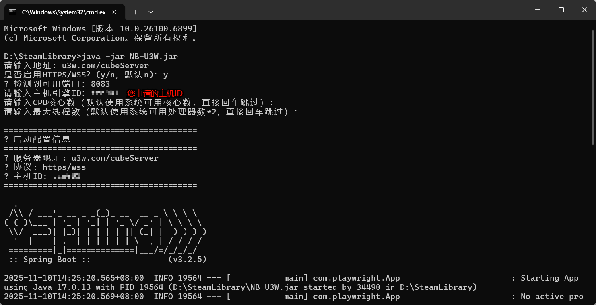
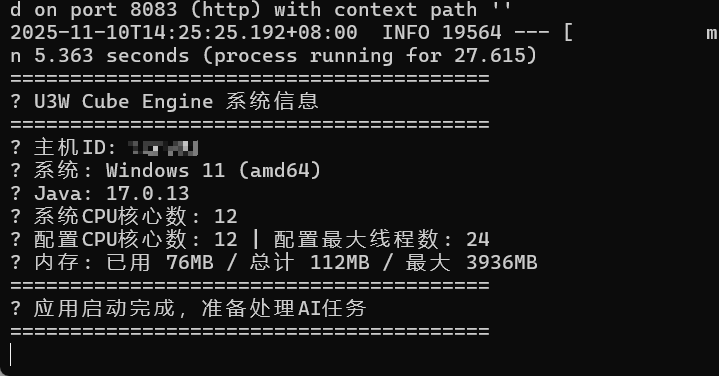

<p align="center">    </p>

# U3W-AI 主机：中小团队AI创意利器，集成多平台资源，一键交互全流程


版本：V2.8

文档更新日期：2025年11月21日


U3W-AI 集成多种 AI 智能体，支持多端访问（PC 端、企业微信应用、微信小程序端、公众号后台），提供 AI 对话、内容生成、智能评分、媒体投递等一系列功能。

#### 核心功能

•多 AI 智能体集成 - 在用户将自己的豆包、腾讯元宝、百度 AI、DeepSeek、秘塔和知乎直答绑定到平台后，支持同一提示词向多个AI组合发问和追问。

•智能内容创作 - 以文本生成为核心功能，通过支持自定义的多AI内容加工模板和版式提示词模板、内置稿库等形式，让内容创意更简单。

•智能评分系统 - 对 AI 生成内容进行多维度评估，内置大量预定义提示词，允许用户对提示词进行增删改。支持用户使用豆包或DeepSeek作为智能评分用的AI工具。

•媒体自动投递 - 已实现支持投递到公众号草稿箱。

•多端协同 - PC 端、企业微信、小程序、公众号智能体数据同步，无缝协作。

#### 技术特色

•完整开源 - 方便个人学习和企业应用，让知识资产和数据资产全方位造福用户

•极低成本用AI - 无需训练或微调模型，仅需用户扫码授权，即可将自己常用的AI集成到系统。

•模块化架构 - 前后端分离，微服务架构设计，方便进行二次开发和组合使用。

•智能提示词 - 支持自定义智能评分提示词和智能排版模板，让您的每个灵感都如虎添翼。

•接口扩展性 - 支持MCP协议及OpenAI api接口，与AI生态最新成果同步互通。


### ⚡ 1分钟快速部署，让团队成员瞬间获得用户级尝鲜体验
## 🚀 NB-U3W 非商业体验版主机上线


#### NB-U3W 优势特点

- ✅ **零配置**：无需安装数据库、Redis 等复杂环境
- ✅ **快速启动**：1分钟即可完成部署
- ✅ **即开即用**：连接云端服务，快速体验完整功能
- ✅ **适合场景**：在没有进行全面部署之前，快速进行功能体验


#### 运行环境要求

- [JDK 17](https://www.oracle.com/java/technologies/javase/jdk17-archive-downloads.html) - Oracle JDK 17 官方下载

#### 首次部署主机抢鲜体验，仅需四步

1. **下载 [NB-U3W.jar](https://u3w.com/chatfile/NB-U3W.jar)**


注意：在该jar包所在目录下启动服务;

启动前，需确保环境已正确配置

打开命令提示符（cmd）输入：
```bash
java -version
```
若未输出版本信息，说明JDK未安装或环境变量未配置正确。


启动服务
```bash
java -jar NB-U3W.jar
```

2. **配置连接参数**

启动后按提示输入以下信息：

```bash
请输入地址：u3w.com/cubeServer
是否启用HTTPS/WSS？(y/n，默认n)：y
✅ 检测到可用端口：（默认8083）
请输入主机ID：[您申请的主机ID]
请输入CPU核心数（默认使用系统可用核心数，直接回车跳过）：跳过即可
请输入最大线程数（默认使用系统可用处理器数*2，直接回车跳过）：跳过即可
```

### 配置参数示例图


### 启动成功示例图


3. **获取主机ID**
   - 联系管理员申请您的专属主机ID
   - 主机ID 用于绑定和识别您的主机实例

   **管理员联系方式：**

   <p align="center">
     
   </p>

   <p align="center">扫描二维码联系管理员申请主机ID</p>

4. **开始登录使用**
   - 访问 [u3w.com](https://u3w.com)
   - 扫码，注册并登录系统
   - 在个人中心添加管理员返回给您的主机ID
   - 开始体验U3W-AI 主机的强大功能！


## 【**进阶**】 [优立方完整部署说明](complete_deployment_guide.md)  **一站式全面部署前后端系统**

