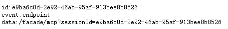
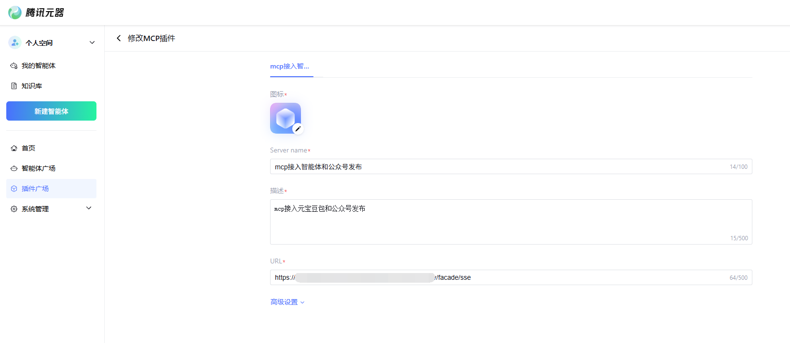
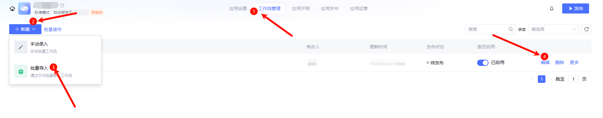
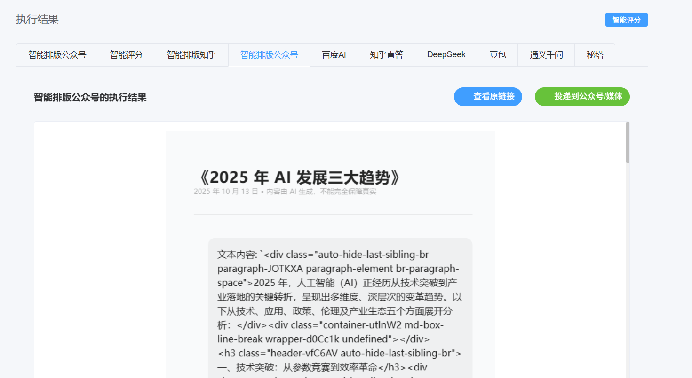
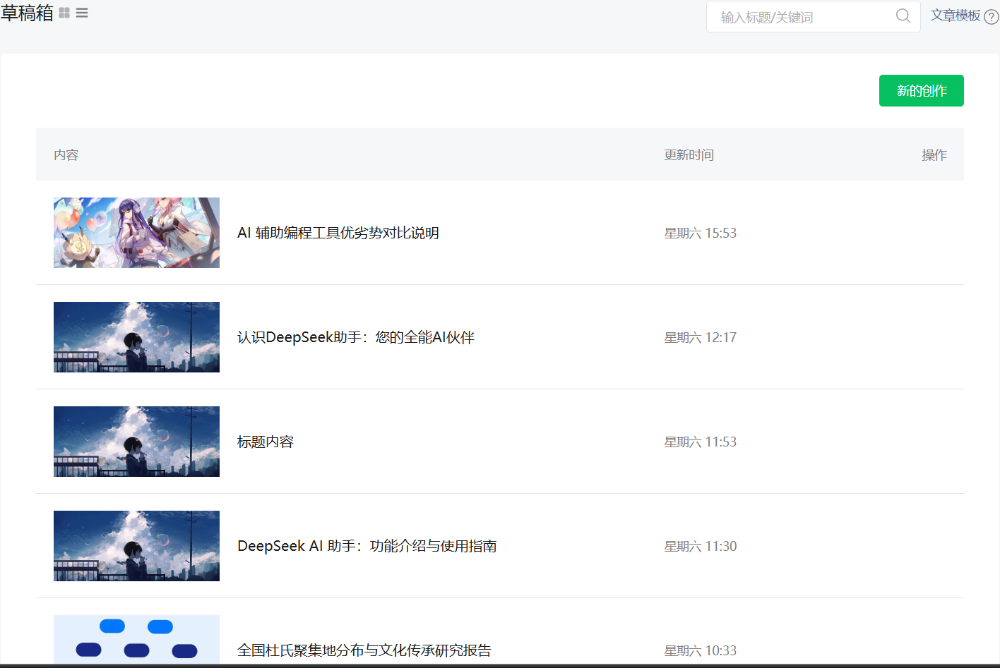

#  U3W优立方AI主机完整部署说明

2025年11月10日 更新

## 概述
本文档将指导您完成U3W优立方AI主机的完整部署，包括环境配置、服务部署、MCP集成、元器配置以及最终测试验证。

## 第一阶段：环境准备

### 1.1 环境要求
- **JDK 17**：确保安装JDK 17版本
- **Git**：用于代码版本控制
- **Maven**：用于项目构建和依赖管理
- **MySQL 8.0+**：关系型数据库
- **Redis 6.0+**：缓存服务
- **Node.js 25**：前端环境
- **操作系统**：Windows 10系统及以上
- **内存要求**：建议16GB（8GB会有卡顿现象）

### 1.2 安装基础环境

#### 安装MySQL 8.0
1. 下载MySQL 8.0安装包：[MySQL官方下载](https://dev.mysql.com/downloads/installer/)
2. 运行安装程序，选择"Developer Default"安装类型
3. 设置root用户密码（建议设置为`qwe#123`以匹配默认配置）
4. 验证安装：
```bash
mysql -u root -p
```

#### 安装Redis 6.0+
1. 下载Redis 6.0或更高版本
2. 解压到指定目录（例如：`C:\Program Files\Redis`）
3. 配置Redis(示例)：
   - 编辑`redis.windows.conf`文件
   - 设置密码：`requirepass 123456`
   - 设置端口：`port 6379`
4. 安装并启动Redis服务：
```bash
cd C:\Program Files\Redis
redis-server --service-install redis.windows.conf --loglevel verbose
redis-server --service-start
```

#### 安装JDK 17、Git、Maven
1. 安装JDK 17：[官网下载](https://www.oracle.com/java/technologies/javase/jdk17-archive-downloads.html)
2. 安装Git：[官网下载](https://git-scm.com/downloads)
3. 安装Maven：[官网下载](https://maven.apache.org/download.cgi)
4. 配置相关环境变量

#### 安装Node.js
1. 下载Node.js 25：[Node.js官网](https://nodejs.org/)
2. 运行安装程序，勾选"Add to PATH"选项
3. 验证安装：`node -v`

### 1.3 克隆项目
```bash
git clone https://gitee.com/U3W-AI/U3W-AI.git
cd U3W-AI
```

## 第二阶段：数据库配置

### 2.1 创建数据库
```bash
mysql -u root -p
CREATE DATABASE IF NOT EXISTS ucube DEFAULT CHARACTER SET utf8mb4 COLLATE utf8mb4_unicode_ci;
```

### 2.2 导入SQL文件
```bash
mysql -u root -p ucube < sql/ucube.sql
```

### 2.3 添加主机ID到白名单
```bash
mysql -u root -p ucube
INSERT INTO sys_host_whitelist (host_id) VALUES ('您的主机ID');  # 主机ID建议使用字母+数字组合，例如user01
```

## 第三阶段：后端服务部署（cube-admin）

### 3.1 安装项目依赖
```bash
mvn clean install
```

### 3.2 配置cube-admin

#### 自定义MCP服务配置（application.yml）

```yaml
  ai:
    mcp:
      server:
        enabled: true
        name: cube-facade-mcp
        version: 1.0.0
        sse-endpoint: /facade/sse
        sse-message-endpoint: /facade/mcp
        capabilities:
          tool: true
```

#### 修改数据库配置（application-druid.yml）
编辑 `cube-admin/src/main/resources/application-druid.yml`：
```yaml
spring:
   datasource:
      druid:
         master:
            url: jdbc:mysql://localhost:3306/ucube?useUnicode=true&characterEncoding=utf8&zeroDateTimeBehavior=convertToNull&useSSL=true&serverTimezone=GMT%2B8&allowMultiQueries=true
            username: root
            password: 12345678
```

#### 修改Redis配置（application.yml）
编辑 `cube-admin/src/main/resources/application.yml`，保持本地Redis配置：
```yaml
spring:
   redis:
      host: localhost
      port: 6379
      password: 123456
```

#### 配置文件上传路径
编辑 `cube-admin/src/main/resources/application.yml`：
```yaml
profile: F:/AGI/chatfile  # 根据您的系统调整路径
upload:
   url: http://localhost:8081/profile/
```

修改 `cube-common/src/main/java/com/cube/common/config/RuoYiConfig.java`：
``` java
public static String getUploadPath()
{
    return "F:/AGI/chatfile";    与上面路径保持一致
}
```

修改日志路径 `cube-admin/src/main/resources/logback.xml`：
```xml
<!-- 日志存放路径 -->
<property name="log.path" value="F:/AGI/logs" />
```

### 3.3 启动cube-admin服务
```bash
cd cube-admin
mvn clean package -DskipTests
java -jar target/cube-admin.jar
```

## 第四阶段：前端服务部署（cube-ui）

### 4.1 安装前端依赖
```bash
cd cube-ui
npm install --legacy-peer-deps
```

### 4.2 启动前端服务
```bash
npm run dev
```

### 4.3 账号密码登录后台
1. 浏览器会自动打开后台页面
2. **使用账号密码登录**：
   - 访问登录页面：`http://localhost:端口号/#/loginpwd`
   - 账号：`admin`
   - 密码：`admin123`
   - 点击登录进入后台


## 第五阶段：核心服务部署（cube-engine）

### 5.1 启动cube-engine服务
```bash
cd cube-engine
mvn clean package -DskipTests
java -jar target/U3W.jar
```
### 5.2 配置cube-engine服务连接
启动后按提示输入以下信息：
```bash
请输入地址：127.0.0.1:8081（或localhost:8081）
是否启用HTTPS/WSS？(y/n，默认n)：n
✅ 检测到可用端口：（默认8083）
请输入主机ID：[您添加至白名单的主机ID]
请输入CPU核心数（默认使用系统可用核心数，直接回车跳过）：跳过
请输入最大线程数（默认使用系统可用处理器数*2，直接回车跳过）：跳过
```

### 5.3 验证服务
访问 `http://localhost:[检测到的可用端口]/swagger-ui/index.html` 查看接口文档

## 第六阶段：主机绑定和AI登录

### 6.1 主机绑定
1. 登录后台管理系统
2. 点击右上角名称→个人中心
3. 在基本资料的主机ID输入框中填写您的主机ID（不包含play-前缀）
4. 保存配置

### 6.2 登录AI服务
1. 返回首页，等待AI登录状态初始化完毕
2. **登录元宝**：
   - 点击元宝登录按钮
   - 使用微信扫描返回的二维码
   - 确认登录成功
3. **登录豆包**：
   - 点击豆包登录按钮
   - 使用豆包app扫描返回的二维码
   - 确认登录成功
4. **登录百度AI**：
   - 点击百度AI登录按钮
   - 使用百度app扫描返回的二维码
   - 确认登录成功
5. **登录DeepSeek**：
   - 点击DeepSeek登录按钮
   - 使用微信扫描返回的二维码
   - 确认登录成功
6. **登录知乎直答**：
   - 点击知乎直答登录按钮
   - 使用知乎app扫描返回的二维码
   - 确认登录成功
7. **登录秘塔**：
   - 点击秘塔登录按钮
   - 使用微信扫描返回的二维码
   - 确认登录成功


## 第七阶段：小程序部署
[点击查看小程序部署详细步骤](cube-mini/deployment_guide.md)

## 第八阶段：内网穿透配置

### 8.1 选择内网穿透工具
推荐以下工具之一：
- **花生壳（Oray）**：操作简单，有免费版本
- **OpenFrp**：开源免费，配置灵活
- **PassNat**：稳定性好，支持多种协议
- **其他选择**：ngrok、frp、natapp等

### 8.2 配置穿透规则
- **本地端口**：8081
- **目标路径**：`/facade/sse`
- **协议**：TCP / HTTP
- - **本地端口**：8081
- **目标路径**：`/mini/getUserByMessage`
- **协议**：TCP / HTTP
- **示例配置**：
  
  ```
  本地地址：127.0.0.1:8081
  公网访问：http://您的域名或IP:端口/facade/sse
  本地地址：127.0.0.1:8081
  公网访问：http://您的域名或IP:端口/mini/getUserByMessage
  ```

### 8.3 验证穿透效果
通过浏览器访问穿透后的公网地址：`http://映射IP:映射端口/facade/sse`，确保能正常访问MCP服务。
	

## 第九阶段：元器平台集成（对话式智能体）

### 9.1 注册元器账号
1. 访问 [腾讯元器平台](https://yuanqi.tencent.com/v2)
2. 使用微信扫码注册并登录
3. 完成账号信息填写
4. 创建**对话式智能体**

### 9.2 配置MCP插件
1. 在元器平台的插件广场中
2. 点击接入MCP插件
3. 配置MCP服务地址：使用您的内网穿透地址



### 9.3 导入工作流
1. 工作流配置文件：[20251029-028A-001.zip](20251029-028A-001.zip)
2. 在元器平台中进入**对话式智能体**的工作流管理页面
3. *新建* 选择批量导入，上传配置文件

4. 导入成功后，编辑工作流

### 9.4 修改工作流配置
1. **更新MCP节点**：
   - 找到工作流中的MCP调用节点，记住配置项
   - 拖动左侧插件搜索你的插件（调用自己的），替换原节点并参考配置项
   - 保存配置


2. **更新获取用户信息**
   - 接口链接使用8081端口号的穿透ip + 端口号

3. **保持默认意图提示词**：
   - 使用默认的"1+问题"格式进行对话
   - 无需修改意图识别提示词


## 注意⚠️
- 在调试阶段获取不到union_id时，可以考虑更改工作流mcp节点的`unionid`字段，参考数据库中的测试账号`ovZrQ673x1GGaP6cX5XUnfzu7TmE`信息进行工作流测试
- 但是请不要使用节点测试，建议使用工作流测试，关于填写的 `API.userOpenid` 字段，当前没有使用。直接点击测试即可

### 9.6 发布对话式智能体
1. 完成所有配置和调试后，点击发布按钮
2. 确认发布设置，包括智能体名称、描述等
3. 等待发布完成

## 第十阶段：初步测试验证

### 10.1 对话式智能体测试
1. 在元器平台中测试对话式智能体
2. 使用"1+问题"格式进行测试对话
3. 验证系统返回相应的回复链接
4. 确认链接可正常访问
5. **重要**：必要时可截图保存验证结果并向技术支持反馈

### 10.2 反馈调试结果
当对话式智能体调试完成并可正常返回链接后：
1. 提供调试截图
2. 提供可访问的链接示例
3. 向技术支持确认调试通过

## 第十一阶段：公众号配置与文章发布功能

**注意：此阶段需要在前面对话式智能体调试完成并反馈后进行**

### 11.1 获取公网IP并提供信息以配置公众号白名单
1. 在浏览器中访问 `ip.cn`
2. 记录显示的公网IP地址
3. **重要**：在整个部署期间保持网络连接稳定，避免IP地址变更
4. 向技术支持提供公网IP地址

### 11.2 Office配置申请
1. 将您的公网IP地址提供给技术支持团队
2. 等待技术支持为您分配服务号配置：
   - `appId`：微信公众号应用ID
   - `appSecret`：微信公众号应用密钥

### 11.3 配置公众号信息
1. 在后台管理中找到公众号配置模块
2. 填写公众号相关信息：
   - 公众号ID和密钥
   - 公众号描述
   - 上传公众号头像等图片素材
3. 保存配置


### 11.4 最终测试验证

#### 进行完整测试调用
1. 在工作流调试中发送测试消息
2. **重要**：发送"1 + 问题"格式，确保意图准确识别
3. 系统应返回相应的回复链接
4. **重要**：发送"1 + 发文章"，根据回复链接生成公众号草稿
5. 验证链接可正常访问

#### 验证文章发布功能
1. 通过系统发布测试文章
   - 切换到内容管理-主机页面，新建对话，AI智能体返回结果之后进行智能排版
   - 智能排版任务流程返回已完成之后发布到公众号/媒体
   - 记录发布成功截图
     
2. 获取文章链接
3. 截图保存验证结果
   
<!--   -->
## 第十二阶段：主要功能测试

### 12.1 提示词功能
1. 进入提示词模板菜单
2. 正常进行增删改操作


### 12.2 主机功能测试
1. 在内容管理菜单目录下正常进入主机页面
2. AI智能体正常显示并且深度思考可以正常点击与切换模式
3. 可正常新建对话并返回执行情况
4. 可正常进行智能评分与返回评分结果
5. 可正常进行排版并返回排版结果
6. 可正常投递到公众号

## 第十三阶段：openAI规范与调用
### 测试openAI规范调用
[点击这里查看 OpenAI 集成步骤](cube-engine/deployment_guide.md#openai集成)

**注意⚠️**
- 不要着急清理各类截图，这些内容必要时可与技术支持方在`腾讯会议`时进行展示

#### 完成部署验证
当以下条件全部满足时，表示部署成功：
- ✅ 前端页面正常显示（账号密码登录）
- ✅ 元宝,豆包,百度AI,DeepSeek,知乎直答,秘塔登录成功
- ✅ 内网穿透服务正常
- ✅ 元器账号配置完成
- ✅ MCP服务正常响应
- ✅ 对话式智能体运行正常
- ✅ 对话式智能体测试调试完成并反馈
- ✅ 小程序配置完成（后期配置）
- ✅ 公众号配置完成（后期配置）
- ✅ 工作流文章发布功能正常（后期功能）
- ✅ openAI调用正常

## 故障排除

### 常见问题
1. **无法账号密码登录**：检查后台服务是否启动，端口是否正确
2. **AI登录失败**：确认网络连接和主机ID配置
3. **MCP服务无法访问**：检查内网穿透配置
4. **工作流执行异常**：验证节点配置和网络连通性

### 技术支持
如遇到问题，请：
1. 查看控制台日志
2. 检查配置文件
3. 联系技术支持团队

---

**完成部署后，您的U3W优立方AI主机将具备完整的微信私域运营能力，包括智能客服、内容管理、用户互动等功能。** 