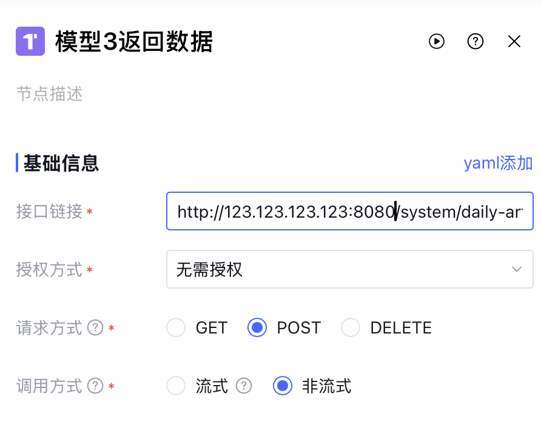

# 福帮手 - 完整部署文档

文档更新日期：2026年1月3日 16：45 文档版本：1.1.8E

---

## 📋 目录

- [第一阶段：环境及数据库配置](#第一阶段环境及数据库配置)
  - [1. 环境要求](#1-环境要求)
  - [2. 安装基础环境](#2-安装基础环境)
  - [3. 数据库初始化](#3-数据库初始化)
- [第二阶段：服务部署](#第二阶段服务部署)
  - [4. 后端服务配置](#4-后端服务配置)
  - [5. 前端服务配置](#5-前端服务配置)
  - [6. 验证部署](#6-验证部署)
- [第三阶段：元器工作流配置](#第三阶段元器工作流配置)
  - [7. 内网穿透配置](#7-内网穿透配置)
  - [8. 元器平台集成](#8-元器平台集成)
  - [9. 工作流导入与配置](#9-工作流导入与配置)
- [第四阶段：测试验证](#第四阶段测试验证)
  - [10. 功能测试](#10-功能测试)
- [常见问题](#常见问题)
- [技术支持](#技术支持)

---

## 第一阶段：环境及数据库配置

## 1. 环境要求

### 1.1 必需环境
- **JDK**: 17+ (推荐使用 OpenJDK 17)
- **Maven**: 3.8+
- **MySQL**: 8.0+
- **Node.js**: 18+ (推荐使用 LTS 版本)
- **npm**: 9+ 或 pnpm: 8+

### 1.2 可选环境
- **Redis**: 6.0+ (用于缓存，可选)

### 1.3 系统要求
- **操作系统**: Windows 10+, macOS 10.15+, Linux
- **内存**: 建议 8GB+ (16GB 更佳)
- **硬盘**: 至少 10GB 可用空间

### 1.4 开发工具
- **后端IDE**: IntelliJ IDEA 2023+ / Eclipse
- **前端IDE**: VS Code / WebStorm
- **数据库工具**: Navicat / DBeaver / MySQL Workbench

---

## 2. 安装基础环境

### 2.1 安装 MySQL 8.0

#### Windows 系统
1. 下载 MySQL 8.0 安装包：[MySQL 官方下载](https://dev.mysql.com/downloads/installer/)
2. 运行安装程序，选择 "Developer Default" 安装类型
3. 设置 root 用户密码（请记住此密码）
4. 验证安装：
```bash
    mysql -u root -p
```

#### macOS 系统
```bash
    # 使用 Homebrew 安装
    brew install mysql@8.0
    
    # 启动 MySQL 服务
    brew services start mysql@8.0
    
    # 设置 root 密码
    mysql_secure_installation
```

#### Linux 系统
```bash
    # Ubuntu/Debian
    sudo apt update
    sudo apt install mysql-server
    
    # CentOS/RHEL
    sudo yum install mysql-server
    
    # 启动服务
    sudo systemctl start mysqld
    sudo systemctl enable mysqld
```

### 2.2 安装 Redis（可选）

#### Windows 系统
1. 下载 Redis for Windows：[GitHub Release](https://github.com/tporadowski/redis/releases)
2. 解压到指定目录（例如：`C:\Program Files\Redis`）
3. 配置 Redis：
   - 编辑 `redis.windows.conf` 文件
   - 设置密码：`requirepass your_password`
4. 安装并启动服务：
```bash
    cd "C:\Program Files\Redis"
    redis-server --service-install redis.windows.conf
    redis-server --service-start
```

#### macOS 系统
```bash
    # 使用 Homebrew 安装
    brew install redis
    
    # 启动 Redis 服务
    brew services start redis
```

#### Linux 系统
```bash
    # Ubuntu/Debian
    sudo apt install redis-server
    
    # CentOS/RHEL
    sudo yum install redis
    
    # 启动服务
    sudo systemctl start redis
    sudo systemctl enable redis
```

### 2.3 安装 JDK 17

#### Windows/macOS
1. 下载 JDK 17：[Oracle JDK](https://www.oracle.com/java/technologies/javase/jdk17-archive-downloads.html) 或 [OpenJDK](https://adoptium.net/)
2. 运行安装程序
3. 配置环境变量 `JAVA_HOME`
4. 验证安装：
```bash
    java -version
```

#### Linux 系统
```bash
    # Ubuntu/Debian
    sudo apt install openjdk-17-jdk
    
    # CentOS/RHEL
    sudo yum install java-17-openjdk-devel
```

### 2.4 安装 Maven

#### Windows 系统
1. 下载 Maven：[Maven 官网](https://maven.apache.org/download.cgi)
2. 解压到指定目录（例如：`C:\Program Files\Maven`）
3. 配置环境变量：
   - `MAVEN_HOME`: Maven 安装目录
   - `Path`: 添加 `%MAVEN_HOME%\bin`
4. 验证安装：
```bash
    mvn -version
```

#### macOS 系统
```bash
    brew install maven
```

#### Linux 系统
```bash
    # Ubuntu/Debian
    sudo apt install maven
    
    # CentOS/RHEL
    sudo yum install maven
```

### 2.5 安装 Node.js

#### 所有系统
1. 访问 [Node.js 官网](https://nodejs.org/)
2. 下载 LTS 版本（推荐 18.x 或 20.x）
3. 运行安装程序，勾选 "Add to PATH" 选项
4. 验证安装：
```bash
    node -v
    npm -v
```

### 2.6 克隆项目
```bash
    git clone https://gitee.com/U3W-AI/U3W-AI.git
    cd U3W-AI
```

---

## 3. 数据库初始化

### 3.1 创建数据库
```bash
# 登录 MySQL
mysql -u root -p

# 创建数据库
CREATE DATABASE IF NOT EXISTS wxfbsir DEFAULT CHARACTER SET utf8mb4 COLLATE utf8mb4_unicode_ci;

# 退出
exit;
```

### 3.2 导入 SQL 文件
```bash
    # 方式1：命令行导入
    mysql -u root -p wxfbsir < sql/wxfbsir.sql
    
    # 方式2：MySQL 客户端导入
    # 1. 打开 Navicat/DBeaver 等工具
    # 2. 连接到 MySQL 服务器
    # 3. 选择 wxfbsir 数据库
    # 4. 执行 SQL 文件
```

### 3.3 验证数据库
```bash
    mysql -u root -p wxfbsir
    
    # 查看表列表
    SHOW TABLES;
    
    # 应该看到以下表：
    # - sys_user, sys_role, sys_menu, sys_dept (系统表)
    # - daily_article (日更助手文章表)
    # - yuanqi_agent_config (元器智能体配置表)
    # - 其他业务表...
```

---

## 第二阶段：服务部署

## 4. 后端服务配置

### 4.1 配置数据库连接
编辑 `WxFbsir-admin/src/main/resources/application-druid.yml`：
```yaml
spring:
  datasource:
    druid:
      master:
        url: jdbc:mysql://localhost:3306/wxfbsir?useUnicode=true&characterEncoding=utf8&zeroDateTimeBehavior=convertToNull&useSSL=true&serverTimezone=GMT%2B8&allowMultiQueries=true
        username: root
        password: your_password  # 修改为您的 MySQL 密码
```

### 4.2 配置 Redis
编辑 `WxFbsir-admin/src/main/resources/application.yml`：
```yaml
spring:
  redis:
    host: localhost
    port: 6379
    password: your_redis_password  # 如果设置了密码
    database: 0
```

### 4.3 配置文件上传路径
编辑 `WxFbsir-admin/src/main/resources/application.yml`：
```yaml
# 文件上传配置
wxfbsir:
  # 文件路径（Windows 示例：D:/upload，Linux 示例：/home/upload）
  profile: /path/to/upload
  # 获取地址开关
  addressEnabled: true
```

### 4.4 配置Gitee OAuth配置

登录gitee，右上角头像 -> 账号设置 -> 第三方应用 -> 创建应用

**注意：**

（1）填写 应用名称 `gitee授权登录`

（2）应用主页 `http://localhost:80`

（3）应用回调地址 `http://localhost:8080/auth`

（4）上传Logo

（5）权限 `全选`

创建应用，获取 `Client ID`和`Client Secret`

编辑 `WxFbsir-admin/src/main/resources/application.yml`：

```yaml
# Gitee OAuth配置
gitee:
  oauth:
    # OAuth Client ID（生产环境建议使用环境变量：GITEE_OAUTH_CLIENT_ID）
    client-id: ${GITEE_OAUTH_CLIENT_ID:}
    # OAuth Client Secret（生产环境建议使用环境变量：GITEE_OAUTH_CLIENT_SECRET）
    client-secret: ${GITEE_OAUTH_CLIENT_SECRET:}
    # 前端地址（OAuth完成后跳转）
    frontend-url: ${GITEE_OAUTH_FRONTEND_URL:}
    # OAuth回调地址（与Gitee应用配置保持一致）
    callback-url: ${GITEE_OAUTH_CALLBACK_URL:}
```

### 4.5 编译打包

```bash
# 安装项目依赖
    mvn clean install
    
    # 开发环境运行
    cd WxFbsir-admin
    mvn spring-boot:run

```


### 4.6 验证后端服务
访问：http://localhost:8080

应该看到启动成功的日志：
```
欢迎使用微信福帮手后台管理框架，当前版本：v1.0.0，请通过前端地址访问。
```

### 4.7 部署Engine服务

Engine服务是独立的副节点服务，通过WebSocket与Admin主节点通信，负责执行浏览器自动化等计算密集型任务。

#### 4.7.1 配置Engine服务

编辑 `WxFbsir-engine/src/main/resources/application.yml`：

```yaml
wxfbsir:
  engine:
    # 主机ID配置（必须在Admin数据库白名单中）
    host-id: engine-001  # 使用数据库中已存在的白名单ID
    
    # 主节点WebSocket连接配置
    admin:
      # 修改为Admin服务的实际地址
      ws-url: ws://localhost:8080/ws/engine
```

**重要配置说明**：
- `host-id`: 必须使用数据库 `ws_host_whitelist` 表中已存在的主机ID
- `ws-url`: Admin服务的WebSocket地址，格式为 `ws://[Admin地址]:[端口]/ws/engine`
- 如果Admin部署在其他服务器，将 `localhost:8080` 替换为实际地址

#### 4.7.2 编译启动Engine

```bash
cd WxFbsir-engine
mvn clean package -DskipTests

# 启动Engine服务
java -jar target/wxfbsir-engine-1.6.5.jar
```

#### 4.7.3 验证Engine连接

**方法1：查看Engine日志**

Engine启动后，应该看到类似日志：
```
[WebSocket] 连接成功 - 服务器: ws://localhost:8080/ws/engine
[WebSocket] 注册成功 - HostID: engine-001
```

**方法2：在Admin管理后台查看**

1. 登录Admin管理后台：http://localhost:80
2. 进入 **主机管理 → 连接记录与在线**
3. 在"在线主机"标签页中，应该能看到：
   - **主机ID**: engine-001
   - **状态**: 在线
   - **版本**: 1.6.5
   - **连接时间**: 当前时间

- 如果看到以上信息，说明Engine服务部署成功并已成功连接到Admin。
- 然后参考[README.md](WxFbsir-engine%2FREADME.md)进行后续测试

**常见问题**：
- 如果连接失败，检查 `ws-url` 配置是否正确
- 如果提示"主机ID不在白名单"，确认数据库中是否已导入 `ws_host_whitelist` 表数据
- 如果提示"重复连接"，说明该主机ID已有其他Engine在线，需要先下线旧连接

---

## 5. 前端服务配置

### 5.1 安装前端依赖
```bash
    cd WxFbsir-ui
    npm install 

```

### 5.2 配置后端接口
编辑 `WxFbsir-ui/.env.development`：
```bash
    # 开发环境
    VITE_APP_BASE_API = '/dev-api'
    
    # 如果后端不在本地，修改为实际地址
    # VITE_APP_BASE_API = 'http://your-backend-server:8080'
```

### 5.3 启动前端服务
```bash
    npm run dev

```

浏览器会自动打开：http://localhost:80

---

## 6. 验证部署

### 6.1 登录系统
1. 访问：http://localhost:80
2. 使用默认账号登录：
   - 账号：`admin`
   - 密码：`admin123`
3. 登录成功后应该看到系统首页

### 6.2 检查功能模块
- ✅ 系统管理：用户管理、角色管理、菜单管理
- ✅ 日更助手：文章列表、智能体配置
- ✅ 元器配置：智能体配置管理

---

## 第三阶段：元器工作流配置

## 7. 内网穿透配置

### 7.1 为什么需要内网穿透？
元器工作流需要通过HTTP回调将生成的内容返回给您的系统。如果您的系统部署在本地或内网环境，元器无法直接访问，因此需要使用内网穿透工具将本地服务暴露到公网。

### 7.2 选择内网穿透工具
推荐以下工具之一：
- **花生壳（Oray）**：操作简单，有免费版本
- **OpenFrp**：开源免费，配置灵活
- **PassNat**：稳定性好，支持多种协议
- **其他选择**：ngrok、frp、natapp等

### 7.3 配置穿透规则
需要穿透的端口和路径：
- **本地端口**：8080（后端服务端口）
- **目标路径**：
  - `/system/daily-article/saveModelContent`
  - `/system/daily-article/updateOptimizedContent`
- **协议**：HTTP

**示例配置**：
```
本地地址：127.0.0.1:8080
公网访问：http://您的域名或IP:端口
```

### 7.4 验证穿透效果
通过浏览器访问穿透后的公网地址：
```
http://映射IP:映射端口
```

如果返回类似以下内容，说明穿透成功：
```
欢迎使用微信福帮手后台管理框架，当前版本：v1.0.0，请通过前端地址访问。
```

### 7.5 记录公网地址
**重要**：请记录您的公网访问地址，后续配置工作流时需要使用：
```
公网地址示例：http://123.456.789.0:12345
或：http://your-domain.com
```

---

## 8. 元器平台集成

### 8.1 注册元器账号
1. 访问 [腾讯元器平台](https://yuanqi.tencent.com/v2)
2. 使用微信扫码注册并登录
3. 完成账号信息填写

### 8.2 创建智能体
1. 点击"创建智能体"
2. 填写智能体基本信息：
   - 名称：日更助手
   - 描述：自动生成文章内容的智能助手
---

## 9. 工作流导入与配置

### 9.1 工作流文件说明
项目提供了以下工作流配置文件（位于 `docs/workflows/` 目录）：

1. **[export-日更助手-高优先级等.zip](docs/workflows/export-%E6%97%A5%E6%9B%B4%E5%8A%A9%E6%89%8B-%E9%AB%98%E4%BC%98%E5%85%88%E7%BA%A7.zip)**
   - 功能：日更助手核心工作流
   - 用途：接收文章标题，调用3个大模型生成内容，优化合并后返回

2. **[export-排版助手-中优先级.zip](docs/workflows/export-%E6%97%A5%E6%9B%B4%E5%8A%A9%E6%89%8B-%E9%AB%98%E4%BC%98%E5%85%88%E7%BA%A7.zip)**
   - 功能：文章智能排版工作流
   - 用途：对已生成的文章进行格式优化和排版

### 9.2 导入日更助手工作流

#### 步骤1：进入工作流管理
1. 登录元器平台
2. 进入刚创建的智能体
3. 点击"工作流管理"标签
4. 点击"新建"按钮，选择"批量导入"


#### 步骤2：上传工作流文件
1. 选择 `export-日更助手-高优先级等.zip` 文件
2. 点击"上传"
3. 等待导入完成（可能需要几秒钟）
4. 导入成功后，会看到工作流节点图

### 9.3 修改HTTP回调节点配置

**重要**：这是最关键的步骤！需要将工作流中的HTTP回调地址修改为您的公网地址。

#### 需要修改的节点
工作流中有 **4个HTTP请求节点** 需要修改：


#### 修改步骤（以"保存模型1内容"为例）

1. **找到HTTP请求节点**
   - 在工作流画布中找到"HTTP请求"节点
   - 节点名称可能是"保存模型内容"或类似名称

2. **点击节点进入配置**
   - 点击节点，右侧会显示配置面板

3. **修改请求URL**
   - 找到"请求URL"配置项
   - 原始地址可能是：`http://localhost:8080/system/daily-article/saveModelContent`
   - 修改为您的公网地址：`http://您的公网IP:端口/system/daily-article/saveModelContent`



4. **保持其他配置不变**
   - 请求方法：POST
   - Content-Type：application/json
   - 请求体：保持原有配置（包含 articleId, modelName, content, modelIndex 等参数）

   

### 9.4 测试工作流

#### 步骤1：使用工作流测试功能
1. 在工作流编辑页面，点击右上角"调试"按钮，然后点击"去调试"按钮
2. 输入测试问题
3. 点击"开始测试"

#### 步骤2：检查回调是否成功
当输出"无消息输出",但有思考过程说明调用成功

### 9.5 发布工作流

测试成功后，发布工作流：
1. 点击"发布"按钮
2. 确认发布设置
3. 等待发布完成

### 9.6 获取工作流配置信息

发布成功后，需要获取以下配置信息：

#### 1. 获取 API 密钥（appKey）

1. **进入应用发布服务状态页面**
   - 点击智能体右上角的"发布"或"应用状态"按钮
   - 进入应用发布服务状态管理页面

2. **在 API 管理中**
   - 点击"复制"按钮

#### 2. 获取智能体 ID（appID）

**推荐方法：从体验链接中提取**

1. **从体验链接提取 appID**
   
   体验链接示例：
   ```
   https://yuanqi.tencent.com/webim/#/chat/mJsohw?appid=1996840&experience=true&space_id=123
   ```
   
   从 URL 中找到 `appid=` 后面的数字，即为智能体 ID：
   ```
   appID: 1996840
   ```

#### 3. 配置信息汇总

请将以下信息记录下来，下一步需要使用：
- **智能体 ID (appID)**：从体验链接提取的数字
- **API 密钥 (appKey)**：从 API 管理复制
- **API 端点**：`https://yuanqi.tencent.com/openapi/v1/agent/chat/completions`（固定值）

### 9.7 在系统中配置智能体

#### 步骤1：登录微信福帮手系统
访问：http://localhost:80

#### 步骤2：进入日更助手页面
点击左侧菜单"日更助手"

#### 步骤3：配置智能体
1. 点击页面右上角"配置智能体"或"元器配置"按钮

2. 填写配置信息：
   ```yaml
   智能体名称: 日更助手（自定义名称）
   智能体ID: 1996840（从体验链接提取的 appID）
   API 密钥: xxxxxxxxxxxxxxxxxxxxxxxxxxxxxxxx（从 API 管理获取）
   API 端点: https://yuanqi.tencent.com/openapi/v1/agent/chat/completions（默认值）
   ```

3. **注意事项**：
   - 智能体ID 必须从体验链接中准确提取
   - API 密钥不要多复制空格或换行符
   - API 端点一般不需要修改

4. 点击"保存"

#### 步骤4：验证配置

1. 保存成功后，页面应该显示"配置成功"提示

2. 创建一篇测试文章验证：
   - 输入任意标题并创建
   - 观察是否进入"处理中"状态
   - 等待 2-3 分钟查看是否生成内容

3. 如果配置失败或生成失败，请检查：
   - appID 是否从体验链接正确提取
   - API 密钥是否完整复制（没有多余空格）
   - 工作流是否已成功发布
   - 内网穿透是否正常运行

### 9.8 导入排版助手工作流（可选）

按照相同步骤导入 `export-排版助手-中优先级.zip`：
1. 创建新的智能体或在现有智能体中新建工作流
2. 导入工作流文件
3. 排版助手工作流**不需要修改HTTP回调**（同步返回结果）
4. 测试并发布

---

## 第四阶段：测试验证

## 10. 功能测试

### 10.1 测试日更助手

#### 步骤1：创建文章
1. 进入"日更助手"页面
2. 点击"创建文章"按钮
3. 输入文章标题，例如："人工智能的未来发展"
4. 选择生成模型（默认选择3个模型）
5. 点击"确定"

#### 步骤2：等待生成
- 系统会显示"创建成功，AI内容正在生成中"
- 文章状态显示为"处理中"
- 等待约2-3分钟（取决于网络和模型响应速度）

#### 步骤3：查看结果
1. 刷新文章列表
2. 文章状态变为"已完成"
3. 点击文章查看详情
4. 应该能看到：
   - 模型1生成的内容
   - 模型2生成的内容
   - 模型3生成的内容
   - 优化后的最终内容

### 10.2 测试排版功能（如果配置了排版助手）

1. 在文章详情页面
2. 点击"智能排版"按钮
3. 等待几秒钟
4. 查看排版后的效果


### 10.3 完成部署验证

当以下条件全部满足时，表示部署成功：

- ✅ 前端页面正常显示
- ✅ 后端服务正常运行
- ✅ 数据库连接正常
- ✅ 内网穿透服务正常
- ✅ 元器智能体配置完成
- ✅ 工作流正常执行
- ✅ HTTP回调正常接收
- ✅ 文章生成功能正常
- ✅ Engine服务部署完成并成功连接到Admin

---

## 常见问题

### Q1: 前端无法访问后端
**症状**：前端页面显示"网络错误"或"无法连接到服务器"

**排查步骤**：
1. 检查后端是否启动：
```bash
# 查看进程
jps | grep WxFbsir

# 查看端口
netstat -ano | grep 8080
```

2. 检查前端配置：
```bash
# 查看 .env.development
cat WxFbsir-ui/.env.development
```

3. 检查跨域配置（后端已配置CORS，一般不会有问题）

### Q2: 数据库连接失败
**症状**：后端启动报错"Unable to connect to database"

**解决方案**：
1. 检查MySQL服务是否启动
2. 检查用户名密码是否正确
3. 检查数据库名称是否存在
4. 检查防火墙设置

### Q3: 工作流回调失败
**症状**：文章一直显示"处理中"，后端没有收到回调

**排查步骤**：
1. 检查内网穿透是否正常：
```bash
curl http://您的公网IP:端口/system/daily-article/saveModelContent
```

2. 检查工作流HTTP节点配置：
   - URL是否正确
   - 是否使用了公网地址
   - 请求方法是否为POST

3. 查看元器工作流执行日志：
   - 登录元器平台
   - 进入智能体 → 工作流 → 执行记录
   - 查看失败原因

4. 检查后端白名单配置：
   - 确认 `SecurityConfig.java` 中已添加回调接口白名单

### Q4: 工作流执行超时
**症状**：元器返回504 Gateway Timeout

**说明**：这是正常现象！元器网关超时时间为60秒，但工作流可能需要更长时间执行。即使返回504，工作流仍在后台执行，最终会通过HTTP回调返回结果。

**解决方案**：
- 无需处理，等待回调即可
- 如果长时间（超过5分钟）没有收到回调，检查工作流执行日志

### Q5: 前端超时错误
**症状**：前端显示"timeout of 10000ms exceeded"

**解决方案**：
已在 `request.js` 中将超时时间设置为10秒，如果仍然超时：
1. 检查网络连接
2. 检查后端是否正常响应
3. 查看后端日志是否有异常

### Q6: 端口被占用
**症状**：启动服务时报错"Port already in use"

**解决方案**：
```bash
# 查看端口占用（Windows）
netstat -ano | findstr :8080

# 查看端口占用（macOS/Linux）
lsof -i :8080

# 杀死进程
kill -9 <PID>

# 或修改端口
# 后端：修改 application.yml 中的 server.port
# 前端：修改 vite.config.js 中的 server.port
```

### Q7: 打包后前端白屏
**症状**：生产环境部署后，访问页面显示白屏

**解决方案**：
1. 检查 `vite.config.js` 中的 `base` 配置
2. 检查 Nginx 的 `try_files` 配置
3. 清除浏览器缓存
4. 查看浏览器控制台错误信息

---

## 技术支持

### 项目文档
- [项目结构说明](./项目结构说明.md)
- [日更助手功能说明](./docs/功能说明/日更助手功能说明.md)
- [代码规范](./docs/代码规范.md)
- [代码合并PR规范](./docs/代码合并PR规范.md)
- [FAQ文档](./docs/FAQ.md)

### 腾讯元器官方
- 官网：https://yuanqi.tencent.com
- 文档：https://yuanqi.tencent.com/docs
- 客服：在线客服

### 联系方式
如遇到部署问题，请：
1. 查看控制台日志
2. 检查配置文件
3. 提交 Issue 到项目仓库

---

**恭喜！** 您已完成当前阶段的微信福帮手的完整部署。


---

## 📚 相关文档

### 核心功能文档
- **[日更助手功能说明](./docs/功能说明/日更助手功能说明.md)** - 日更助手完整功能介绍、技术架构、数据库设计、核心代码实现
- **[功能说明目录](./docs/功能说明/README.md)** - 所有功能模块的说明文档索引
- **[项目结构说明](./项目结构说明.md)** - 项目目录结构和模块职责详细说明

### 开发规范
- **[代码规范](./docs/代码规范.md)** - Java、Vue 代码规范和最佳实践
- **[代码合并PR规范](./docs/代码合并PR规范.md)** - Git 工作流和 PR 提交规范
- **[文档规范总结](./docs/文档规范总结.md)** - 项目文档编写规范

### 问题解答
- **[FAQ文档](./docs/FAQ.md)** - 常见问题汇总
